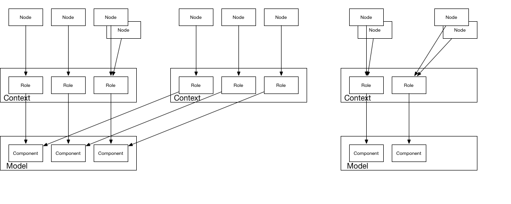
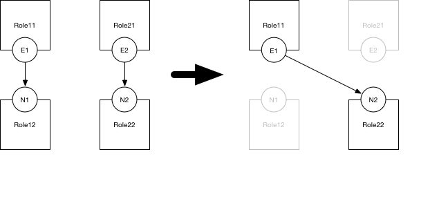

# Introduction

ANCL is a text based declarative language for describing how network services communicate with each other.

This document describes the:

* General definition format
* The base objects of ANCL
* Connecting ANCL objects
* Maintaining ANCL objects in a file
* Validating ANCL objects

## Text Convention

All spec definitions are in YAML. Quoted items are literals. Unquoted items refer to other specs or fields.

Other encodings could be used, but YAML is the preferred one.

## Metadata

Most of the Objects in ANCL are represented by hashes. This means arbitrary names can be added. The only arbitrary name *in spec* is "metadata". The structure of the metadata is not specified as long as it is well enclosed YAML. The metadata field can be used for extensibility not otherwise specified at this time.

It is strongly recommended that metadata for a specific application purpose (e.g. a visualization application) keeps that metadata separate from the ANCL models and merges it when needed.

ANCL spec processors *should* pass along metadata untouched, but *may* modify the metadata in any way that is appropriate for that processor.

## Name Qualifying

Several Objects in ANCL are logically inside of other Objects. The `::` operator is used to qualify the names outside of places in the spec where the name is ambiguous.

# Base Objects

ANCL has 5 base objects:

* Component: a network service in the abstract sense. e.g. `web-server`
* Model: collection of Components related to each other. e.g. `web-api-service`
* Context: an instance of a Model designated by an identifier. e.g. `prod::web-api-service`
* Role: the instance of a Component inside of a Context. e.g. the "prod" web-api-service's web-server `prod::web-api-service::web-server`
* Node: an item in a network which can claim Roles. Host `web01` which is asociated with `prod::web-api-service::web-server`

## Component

A Component is a general item which represents the most basic item in a network service. It can represent anything from a web server to a client which connects to that web server to the ssh client which is used to manage that network server to other items.

### ComponentSpec

    "name": ComponentName
    "ingress": ServiceList
      ServiceName: ServiceSpec
    "egress": DependencyList

The Component is mainly composed of two lists:

* ingress/Service: a network application running on a Component. It is described by a services of tcp and udp ports which can be connected to.
* egress/Dependency: a reference to a Service on another (or the same) Component

**Example**

    - name: web-server
      ingress: ...
      egress: ...
    - name: db
      ingress: ...
      egress: ...

### ServiceListSpec

    - ServiceSpec
    - ServiceSpec
    ...

The ServiceList is an array of ServiceSpecs.

### ServiceSpec

    "name": ServiceName
    ["ports":
      - StartPort + ["-" + EndPort + ] "/" + Protocol
      - StartPort + ["-" + EndPort + ] "/" + Protocol
      ...]

The ServiceSpec has two parts:

* name: Used to identify the local reference (i.e. do not fully qualify) for this Service.
* ports: An array of port information. If present, it's an array of strings of traditional port specifications. If not present, it makes the Service abstract (see Connections).
  * StartPort: The numeric value of the start of the range of network ports which will/could be listened on.
  * EndPort: The numeric value of end of the range of network ports which will/could be listened on.
  * Protocol: "tcp" or "udp"

_Future work: describe other than L4 protocols or protocol requirements (e.g. TLS)._

**Example**

    - name: http
      ports:
      - "80/tcp"
    - name: https
      ports:
      - "443/tcp"
    - name: rpc
      ports:
      - "49152-65535/udp"

### DependencyList

    - DependencySpec
    - DependencySpec
    ...

The DependencyList is an array of references to other Components and Services.

### DependencySpec

    "name": ComponentName + "::" + ServiceName

The Dependency is a simple reference to the Service of a Component.

_Future work: Add an transport needs into the DependencySpec. E.g. "use proxy X", "TLS"_

**Example**

    - name: "web-server::https"
    - name: "db::sql"

## Model

A Model is a logical collection of Components that reference each other.

Models provide a way of collecting common patterns. They're also a bit of namespacing ANCL objects. All ServiceNames/ComponentNames are locally scoped - a Component in a Model must only reference other Components in that Model.

Some examples of Models:

* "oracle" Model to represent to how Databases and Clients communicate amongst each other.
* "webapp" Model to represent a three tier self-contained application.

### ModelSpec

    "name": ModelName
    "components":
      - ComponentSpec
      - ComponentSpec
      ...

The ModelSpec has a name and a list of ComponentSpecs.

_Future Work: Specify version number in the Model._

** Example **

    - name: "web-api-service"
      components: ...

## Context

A Context is a way of instantiating Models. It allows for reuse without overly connecting the underlying components. Any system implementing ANCL must treat the Models in separate Contexts as completely separate.

Typical uses for Contexts:

* Environment: "prod" vs "dev"
* Regional: "us" vs "eu"
* Fault Domain: "domain1" vs "domain2"
* Organizational: "group1" vs "group2"

As the Context is a wider namespacing item, the Context spec is minimal. It currently exists primarily to provide a place to

* Declare Context names
* Attach metadata

An explicit Context declaration is *not* required unless the spec processor indicates that with a flag or option.

### ContextSpec

    "name": ContextName + "::" + ModelName

_Future work: specify version number for Models in the Context._

## Role

A Role is an instance of a Component inside of a specific Context.

Much like Context, the Role is a namespace qualifying item. The RoleSpec only exists to:

* Declare Role names
* Attach metadata

An explicit Role declaration is *not* required unless the spec processor indicates that with a flag or option.

### RoleSpec

    "name": ContextName + "::" + ModelName + "::" + ComponentName

_Future Work: Overriding ServiceSpecs for a specific Role which does not affect Models_

## GroupRole

A typical use case is relationship to infrastructure services. In this case, several Roles show up on the same nodes (e.g. monitoring client, ssh endpoint, etc). Instead of having to repeat the same Roles, you can specify a Group Role. A Group Role is an alias for a collection of Roles.

The GroupRoleName has the same form as a standard RoleName, but the ModelName in the RoleName is "grouprole" and the ComponentName is a unique Identifier.

### GroupRoleSpec

    "name": ContextName + "::grouprole::" + GroupRoleIdentifier
    "roles":
    - RoleName
    - RoleName
    ...

**Example**

    - name: prod::grouprole::webapihosts
      roles: [prod::web-api-service::web-server, prod::web-api-service::db]

## Node

A Node is an endpoint in an actual setting. It claims Roles. In most cases, this will correspond to an actual host or endpoint IP.

That endpoint can represent:

* IP address
* Network Device Object Group
* Cloud Security Group

In short, anything that can be expected to have the networking needs of a Role can be a Node. The current simple specifications only provide for IP addresses.

### NodeSpec

    "name": unique identifier for this node
    "roles":
    - RoleName
    - RoleName
    ...

**Example**

    - name: "192.0.2.16/32"
      roles: ["prod::web-api-service::web-server", "prod::grouprole::webapihosts"]
    - name: "192.0.2.32/32"
      roles: ["prod::web-api-service::db", "prod::grouprole::webapihosts"]

# Connecting

Models work very well for describing how an application as a whole communicates, but one Model does not scale for managing all of the applications in an environment. At some point, Models must be broken out and it is not always easy to draw clean lines of separation, so ANCL allows you to stitch Models together using Connections.

Connections are applied to the final assembly of different Models in an environment - it's only after Models have been put into specific Contexts that they can be referenced for connections (i.e. you can start saying "this prod DB sql connection is the one used by the prod webapp," not "**all** DB models will be connected with **all** webapp models").

Connections work by providing a substitution of an Service or a Dependency with another one. This is reflected by two patterns:

1. IngressConnection: The typical pattern is to substitute from an abstract Service description (e.g. lacking a port specification) with one that is concrete. This replaces something that is incomplete, and applies to all instances of that Service in that Model.
1. EgressConnection: The less used case is one where only a specific Dependency needs a substitution.

EgressConnections take precendent over IngressConnections. If both exist for a particular relationship, use the EgressConnection.

As only one ServiceSpec can resolve in the final connected view, a Connection will either fill out an abstract ServiceSpec or replace a ServiceSpec in one of the Models.

General ConnectionSpec:

    IngressConnectionSpec || EgressConnectionSpec

### IngressConnectionSpec

    "ingress": ContextName(A)::ModelName(A)::ComponentName(A)::ServiceName(A)
    "with": ContextName(B)::ModelName(B)::ComponentName(B)::ServiceName(B)

The `"ingress"` ConnectionSpec replaces the ServiceSpec from the (A) Context::Model::Component with the (B) Context::Model::Component.

**Example**

    - ingress: Context1::Model1::Component12::N1
      with: Context2::Model2::Component22::N2

    - ingress: prod::web-api-service::db::sql
      with: prod::oracle::db::sqlnet

### EgressConnectionSpec

    "egress": ContextName(A)::ModelName(A)::ComponentName(A1)::ComponentName(A2)::ServiceName(A)
    "with": ContextName(B)::ModelName(B)::ComponentName(B1)::ComponentName(B2)::ServiceName(B)

The `"egress"` ConnectionSpec replaces the Dependency from of (A1) Context(A)::Model(A)::Component(A1) on Context(A)::Model(A)::Component(A2)::ServiceName(A) with the Dependency of Context(B)::Model(B)::Component(B1) on Context(B)::Model(B)::Component(B2)::ServiceName(B).

_This pattern may be indicative of an original Model which doesn't reflect a clean separation of Models. It should be avoided._

**Example**

    - egress: Context1::Model1::Component11::Component12::N1
      with: Context2::Model2::Component21::Component21::N2

    - egress: prod::web-api-service::web-server::db::sql
      with: prod::oracle::client::db::sqlnet

# ANCL Objects in Files

The above Specs can be stored in a portable manner in a file. The main requirement is that Specs in a file should be contained inside a hash of arrays for that Spec type. The Spec types and keys are:

* Connections: `connections`
* Contexts: `contexts`
* GroupRoles: `groups`
* Models: `models`
* Nodes: `nodes`
* Roles: `roles`

This same format can be used for any undifferentiated system. E.g. can be used to pass around Specs in API calls.

Systems may spread the Spec definitions out over multiple files. Specs inside of file should be fully defined and valid.

Common reasons for separate files:

* Store each application Model separately; allow different contributions to each application Model, e.g. one dev groups handle one Model and another dev group handles a different model
* Store Contexts, Roles, Connections, and Nodes in separate files for logical groupings of hosts and environments.
* Store spec processor application metadata separate from underlying Specs.

## Loading Multiple Files

While loading multiple files, they should be merged together:

1. If a Spec does not exist as referenced by "name", create a new one.
1. If a Spec does exist as referenced by "name", combine it with the existing one. Ignore duplicates. Error if there are conflicts:
  * Singleton fields with different values

## Spec for Files

    [models:
    - ModelSpec
    - ModelSpec
    - ...]
    [contexts:
    - ContextSpec
    - ContextSpec
    - ...]
    [roles:
    - RoleSpec
    - RoleSpec
    - ...]
    [connections:
    - ConnectionSpec
    - ConnectionSpec
    - ...]
    [nodes:
    - NodeSpec
    - NodeSpec
    - ...]

# Validation

On a first pass, all ANCL Objects are considered invalid if they do not adhere to the formats listed here. In addition, some each Object has some additional validation.

## Component

A Component is invalid if:

* It does not have `ingress` or `egress` with at least the empty array, `[]`.
* Any `ingress` or `egress` stanzas do not comply with the Spec here.
* Its `egress` references a Component that does not exist.

## Connections

A Connection is invalid if:

* It contains both `ingress` and `egress`
* If it is `ingress` and its `with` does not reference a valid full qualified Service
* If it is `egress` and its `with` does not reference a valid full qualified Dependency
* If it is `ingress` and another `ingress` exists covering this relationship
* If it is `egress` and another `egress` exists covering this relationship

## Contexts

There are no additional rules for Context validation.

## Model

A Model is invalid if:

* Any of its Components are invalid

## Node

A Node is invalid if:

* Any of its role references reference an invalid Role

## Role

A Role is invalid if:

* It does not reference a valid Model
* It references any Model which has an abstract ServiceSpec that has not been substituted with a Connection
* Context declaration is required and it does not reference a valid Context
